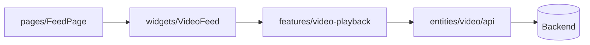

# Brainstorming & Architecture — Detailed Reference

## Clarifying Questions (use sparingly)

Ask only what blocks a sound recommendation. Batch 1–3 questions max.

Examples:

- Who is the user and what is the success criterion?
- Is this net-new UI or extending an existing slice?
- Offline / auth / realtime requirements?
- Target platforms (iOS, Android, web)?
- Deadline or MVP scope?

If the user said "just brainstorm", proceed with labeled assumptions instead of blocking on answers.

---

## Option Quality Bar

Each option should be:

- **Distinct** — different trade-offs, not cosmetic variants
- **Actionable** — someone could implement from the description
- **Honest** — include real cons and migration cost

Avoid:

- Strawman "bad" options
- Ten options with no recommendation
- Recommending a library without comparing one alternative

---

## FSD Placement Examples (Expo Nav)

### New auth flow

```txt
src/features/auth/
  api/           # login, refresh, logout calls
  model/         # session store, types
  ui/            # LoginForm, buttons
src/pages/login/
  ui/            # LoginPage composes feature + layout
src/entities/user/
  model/         # User type, selectors
  api/           # getProfile
```

### Video feed screen

```txt
src/pages/feed/
  ui/            # FeedPage — thin orchestration
src/widgets/video-feed/
  ui/            # list + swipe container
src/features/video-playback/
  model/         # active video id, pause rules
  lib/           # preload helpers
src/entities/video/
  model/         # Video entity
  api/           # fetch feed
src/shared/ui/
  CachedVideo/   # if shared player wrapper
```

### App-wide theme

```txt
src/shared/config/theme.ts
src/app/providers/ThemeProvider.tsx
```

---

## Architecture Decision Record (ADR) — optional

Use when the user wants a durable decision log:

```markdown
# ADR-NNN: [Title]

## Status
Proposed | Accepted | Deprecated

## Context
[Problem and forces]

## Decision
[What we chose]

## Consequences
- Positive: ...
- Negative: ...
```

---

## Diagrams

Use **mermaid** for flows when it helps (navigation, data flow, state machines). Keep diagrams small.

Example — feature data flow:



---

## Phasing Guidelines

| Phase | Typical content |
|-------|-----------------|
| 1 — Skeleton | Routes, empty UI, types, FSD folders |
| 2 — Core path | Happy path only |
| 3 — Edge cases | Errors, empty, loading |
| 4 — Polish | Perf, a11y, analytics |

Each phase should be shippable or reviewable as its own PR when possible.

---

## Trade-off Dimensions

Score options lightly (Low / Medium / High) on:

- Implementation effort
- Runtime performance (RN lists, animations)
- Coupling to existing code
- Testability
- Operational risk (OTA, native modules)
- Team familiarity

---

## Anti-Patterns In Planning

| Anti-pattern | Instead |
|--------------|---------|
| "We'll add a utils folder" | Domain segment: `lib`, `model`, `api` |
| "One big FeatureProvider" | Split context by domain |
| "Fetch in the screen for speed" | `features/*/api` + TanStack Query |
| "Abstract everything now" | YAGNI — extract on second use |
| Plan with 15 new files upfront | Start minimal; list optional extractions |

---

## Handoff To Implementation

When the user approves the plan:

1. Ensure product requirements exist in `docs/requirements/<feature-slug>.md` (**requirements-planner** if missing)
2. Save the plan to `docs/plans/<feature-slug>.md` (see [docs/plans/README.md](../../../docs/plans/README.md))
3. Run **plan-verifier** (pre-implementation) before **implementator**
4. List concrete files to create/edit
5. Note which skills apply (react, react-native)
6. Suggest verification: `yarn typecheck`, `yarn lint`, manual test paths
7. Do not commit unless asked
